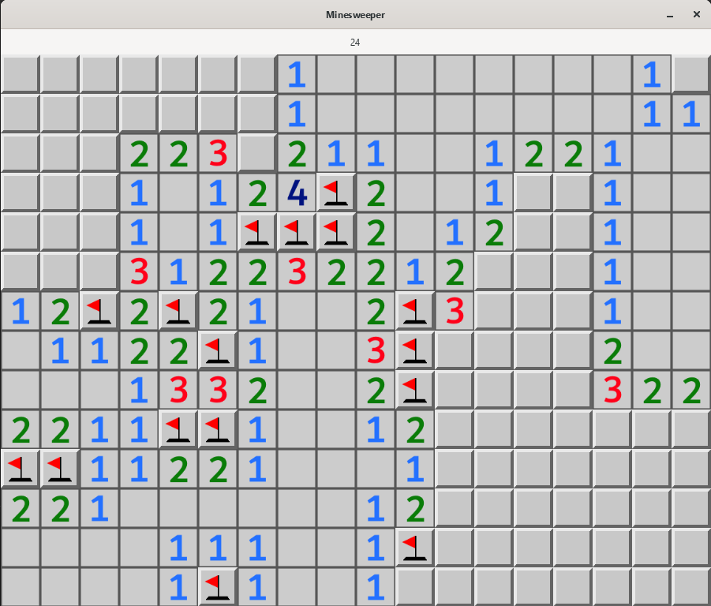

# Minesweeper

A minesweeper game I made in C

Uses GTK4 for GUI

Minesweeper.exe is located in the bin folder. DLL files are required to run.

You can press the "R" key at anytime to reset the game.

